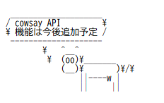

# cowsay-api


cowsay 系統の機能を提供する API

## Usage

### cowsay
```sh
https://cowsay-api.ant-npb.workers.dev/api/cowsay?text=hoge
```
### output
```json
{
  "text": "[cowsay の出力結果(長いので省略)]"
}
```

#### options
| args       | type    | info                                                             |
| :--------- | :-----  | :--------------------------------------------------------------- |
| text       | string  | cowsay が喋るテキストです。                                        |
| eyes       | string  | cowsay の目です。                                                 |
| tongue     | string  | cowsay の舌です。                                                 |
| wrap       | boolean | ワードラップ(自動改行)を無効化かするかどうか。 cowsay -n と同等です。 |
| wrapLength | number  | ふきだしの列幅です。 cowsay -W と同等です。                         |

#### example
```sh
https://cowsay-api.ant-npb.workers.dev/api/cowsay?text=hoge&eyes=oO&tongue=U&wrap=false&wrapLength=40
```

## Development
```
npm install
npm run dev
```

```
npm run deploy
```
