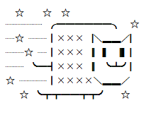

# cowsay-api


cowsay 系統の機能を提供する API

## Usage

### cowsay
```sh
https://cowsay-api.ant-npb.workers.dev/api/cowsay?text=hoge
```
### output
```json
{
  "text": " ______\n< hoge >\n ------\n        \\   ^__^\n         \\  (oo)\\_______\n            (__)\\       )\\/\\\n                ||----w |\n                ||     ||",
  "arrayText": [
    " ______",
    "< hoge >",
    " ------",
    "        \\   ^__^",
    "         \\  (oo)\\_______",
    "            (__)\\       )\\/\\",
    "                ||----w |",
    "                ||     ||"
  ]
}
```

#### options
| args       | type    | info                                                             |
| :--------- | :-----  | :--------------------------------------------------------------- |
| text       | string  | cowsay が喋るテキストです。                                        |
| eyes       | string  | cowsay の目です。                                                 |
| tongue     | string  | cowsay の舌です。                                                 |
| wrap       | boolean | ワードラップ(自動改行)を無効化かするかどうか。 cowsay -n と同等です。 |
| wrapLength | number  | ふきだしの列幅です。 cowsay -W と同等です。                         |
| mode       | string  | cowsay のモードです。 cowsay -b などの各種コマンドと同等です。       |

#### example
```sh
https://cowsay-api.ant-npb.workers.dev/api/cowsay?text=hoge&eyes=oO&tongue=U&wrap=false&wrapLength=40&mode=b
```

---


### cat-me
```sh
https://cowsay-api.ant-npb.workers.dev/api/cat-me
```

### output
```json
{
  "text": "猫AAランダム出力(以下はランダムで nyan が選ばれた時の出力例)",
  "arrayText": [
    "  ☆    ☆  ☆      ",
    "┈┈┈┈ ╭━━━━━━╮  ☆   ",
    "┈☆ ┈┈┃╳╳╳▕╲▂▂╱▏  ",
    "┈┈☆ ┈┃╳╳╳▕▏▍▕▍▏  ",
    "┈┈ ╰━┫╳╳╳▕▏╰┻╯▏  ",
    "☆ ┈┈┈┃╳╳╳╳╲▂▂╱   ",
    "   ☆ ╰┳┳━━┳┳╯   ☆"
  ]
}
```

#### example
```sh
https://cowsay-api.ant-npb.workers.dev/api/cat-me?catName=nyan
```

#### options
| args    | type    | info                  |
| :------ | :-----  | :--------             |
| catName | string  | 猫AA の指定を行います。 |

#### Cats AA List
* grumpy
* approaching
* tubby
* confused
* playful
* thoughtful
* delighted
* nyan
* resting

---

### figlet
```sh
https://cowsay-api.ant-npb.workers.dev/api/figlet?text=BE_FIRST
```

### output
```json
{
  "text": "  ____  _____     _____ ___ ____  ____ _____ \n | __ )| ____|   |  ___|_ _|  _ \\/ ___|_   _|\n |  _ \\|  _|     | |_   | || |_) \\___ \\ | |  \n | |_) | |___    |  _|  | ||  _ < ___) || |  \n |____/|_____|___|_|   |___|_| \\_\\____/ |_|  \n            |_____|                          ",
  "arrayText": [
    "  ____  _____     _____ ___ ____  ____ _____ ",
    " | __ )| ____|   |  ___|_ _|  _ \\/ ___|_   _|",
    " |  _ \\|  _|     | |_   | || |_) \\___ \\ | |  ",
    " | |_) | |___    |  _|  | ||  _ < ___) || |  ",
    " |____/|_____|___|_|   |___|_| \\_\\____/ |_|  ",
    "            |_____|                          "
  ]
}
```

#### options
| args       | type    | info                          |
| :--------- | :-----  | :---------------------------- |
| text       | string  | figlet で出力するテキストです。 |

#### example
```sh
https://cowsay-api.ant-npb.workers.dev/api/figlet?text=zundamon
```

## Development
```
npm install
npm run dev
```

```
npm run deploy
```
